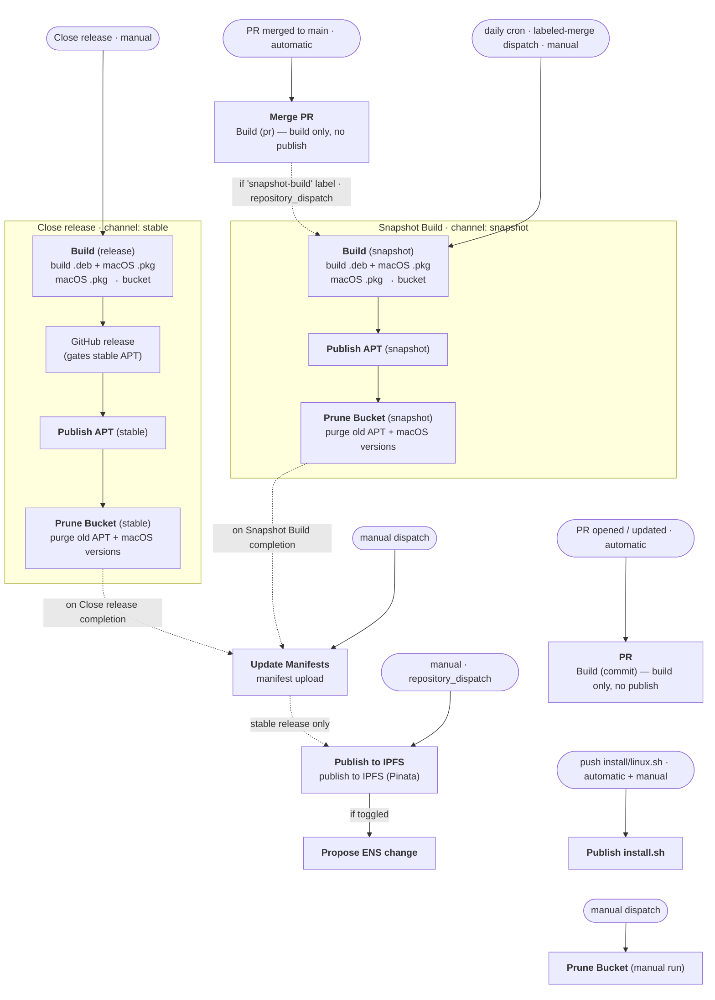

# Gnosis VPN

This repository collects the binary artifacts that compose the Gnosis VPN project.

## Installation

### Debian / Ubuntu

Install via the APT repository (recommended):

```bash
curl -fsSL https://download.gnosisvpn.io/linux/install.sh | sudo bash
```

The installer accepts options after `-s --`:

- `--channel=<stable|snapshot>` — APT channel to subscribe to; `snapshot` is the nightly channel (default: `stable`).
  Env var: `GNOSISVPN_CHANNEL`.

  ```bash
  curl -fsSL https://download.gnosisvpn.io/linux/install.sh | sudo bash -s -- --channel=snapshot
  ```

- `--network=<jura|rotsee>` — network to configure (default: `jura` on first install; omitting keeps an existing
  choice). Env var: `GNOSISVPN_NETWORK`.

  ```bash
  curl -fsSL https://download.gnosisvpn.io/linux/install.sh | sudo bash -s -- --network=rotsee
  ```

- `--reset-identity` — back up the worker's config directory (`/var/lib/gnosisvpn/.config/`, holding the HOPR identity,
  safe, and node database) by renaming it to `.config.<timestamp>.bak`, and remove the network override
  (`/etc/gnosisvpn/gnosisvpn-dynamic.env`), so the service generates a fresh identity on restart. Env var:
  `GNOSISVPN_RESET_IDENTITY=true`.

  ```bash
  curl -fsSL https://download.gnosisvpn.io/linux/install.sh | sudo bash -s -- --reset-identity
  ```

- `-h`, `--help` — show the installer's help and exit.

  ```bash
  curl -fsSL https://download.gnosisvpn.io/linux/install.sh | sudo bash -s -- --help
  ```

Snapshot installs and upgrades pull from `download.gnosisvpn.io` only — the IPFS mirror serves just the stable suite.

**Switching channels:** re-run the installer with the desired `--channel`. Switching snapshot→stable performs an
automatic pinned downgrade to the newest stable release (snapshot versions always sort above stable ones, so plain
`apt upgrade` would never move back on its own). Caution: a re-run without `--channel` selects the default (stable) — on
a snapshot installation, pass `--channel=snapshot` again when re-running, e.g. to switch networks. Manually installing a
`.deb` from the other channel (`sudo apt install ./gnosisvpn_*.deb`) re-points
`/etc/apt/sources.list.d/gnosisvpn.sources` at that package's channel; run `sudo apt-get update` afterwards.

The installer sets up the default network (`jura`) on first install and keeps an existing choice on re-runs. To pick a
different network — or to switch an existing installation — pass `--network` (combinable with `--channel`; see
[.deb Installation Environment Variables](#deb-installation-environment-variables)):

```bash
curl -fsSL https://download.gnosisvpn.io/linux/install.sh | sudo bash -s -- --network=rotsee
```

Manual repo setup (equivalent to what the installer does for the stable channel — it lists both mirrors, the IPFS/ENS
gateway and the CDN, as independent sources of the same signed packages; for snapshot use `Suites: snapshot`,
`Components: snapshot`, and only the `download.gnosisvpn.io` URI). The `$(dpkg --print-architecture)` command detects
the host architecture automatically:

```bash
# 1. Add the signing key
sudo install -dm 0755 /etc/apt/keyrings
curl -fsSL https://download.gnosisvpn.io/linux/apt/gnosisvpn-archive-keyring.gpg \
  | sudo install -m 0644 /dev/stdin /etc/apt/keyrings/gnosisvpn-archive-keyring.gpg

# 2. Add the repository
sudo tee /etc/apt/sources.list.d/gnosisvpn.sources >/dev/null <<EOF
Types: deb
URIs: https://downloads.vpn.gnosis.eth.limo/linux/apt https://download.gnosisvpn.io/linux/apt
Suites: stable
Components: main
Architectures: $(dpkg --print-architecture)
Signed-By: /etc/apt/keyrings/gnosisvpn-archive-keyring.gpg
EOF

# 3. Install
sudo apt-get update && sudo apt-get install -y gnosisvpn
```

Manual `.deb` download is available directly from [the releases page](https://github.com/gnosis/gnosis_vpn/releases), or
the APT pool at `https://download.gnosisvpn.io/linux/apt/pool/main/g/gnosisvpn/gnosisvpn_<version>_<arch>.deb` (with
matching `.asc` and `.sha256` sidecars at the same prefix). See [SECURITY.md](./SECURITY.md) for verification.

Install:

Either double-click the `.deb` file to open it in the App Center and then click the Install button, or run:

```bash
sudo apt install ./gnosisvpn_*.deb
```

To pick a network (and optionally a custom Blokli endpoint) when installing the `.deb` directly, set the environment
variables with `sudo env` (a plain `sudo GNOSISVPN_NETWORK=... apt install` only passes the variable through if your
sudoers policy keeps it, which is often disabled; `sudo env` always works):

```bash
sudo env GNOSISVPN_NETWORK=rotsee apt install ./gnosisvpn_*.deb
sudo env GNOSISVPN_NETWORK=rotsee GNOSISVPN_HOPR_BLOKLI_URL=https://blokli.example.com apt install ./gnosisvpn_*.deb
```

Note: re-installing the **same version** via `apt` does nothing — the package scripts don't re-run, so environment
variables passed this way are silently ignored. To change settings on an existing installation, re-run the installer
script with the matching flag (or use `sudo env GNOSISVPN_...=<value> dpkg -i ./gnosisvpn_*.deb`).

Installing the `.deb` directly also registers the APT source for the package's own channel (stable for release versions,
snapshot for versions containing `+`), so subsequent `apt-get update && apt-get upgrade` picks up new releases without
running the installer script. An existing `/etc/apt/sources.list.d/gnosisvpn.sources` is left untouched unless it tracks
the other channel.

Uninstall:

```bash
sudo apt remove gnosisvpn
```

### .deb Installation Environment Variables

Direct `.deb` installs have no flags — these environment variables configure the package scripts instead (set them with
`sudo env`, see above). They are also honored by the installer script.

- `GNOSISVPN_NETWORK=<jura|rotsee>` — network configuration to use (default: `jura`); determines which configuration
  file is symlinked to `/etc/gnosisvpn/config.toml` during installation.

  ```bash
  sudo env GNOSISVPN_NETWORK=rotsee apt install ./gnosisvpn_*.deb
  ```

- `GNOSISVPN_HOPR_BLOKLI_URL=<url>` — URL of the HOPR Blokli service (default: `https://blokli.<network>.hoprnet.link`
  for the selected network). The effective URL is written to `/etc/gnosisvpn/gnosisvpn-dynamic.env` (which overrides the
  packaged `/etc/gnosisvpn/gnosisvpn.env` conffile, kept empty so upgrades stay prompt-free).

  ```bash
  sudo env GNOSISVPN_HOPR_BLOKLI_URL=https://blokli.example.com apt install ./gnosisvpn_*.deb
  ```

- `GNOSISVPN_RESET_IDENTITY=true` — back up the worker's config directory (`/var/lib/gnosisvpn/.config/`, holding the
  HOPR identity, safe, and node database) by renaming it to `.config.<timestamp>.bak`, and remove the network override
  (`/etc/gnosisvpn/gnosisvpn-dynamic.env`), before the service starts, so a fresh identity is generated (default:
  `false`).

  ```bash
  sudo env GNOSISVPN_RESET_IDENTITY=true apt install ./gnosisvpn_*.deb
  ```

## Reporting Issues

To help us manage feedback and improve the project, we use a discussion-first process for all bug reports and feature
requests.

### How to report an issue

1. Search existing [Discussions](../../discussions) and [Issues](../../issues) to check if your topic is already
   covered.
1. If not, start a new Discussion in the [Issues & Bug Reports](../../discussions/new?category=issues-bug-reports)
   category.
1. Provide as much detail as possible using the provided template.

The team will review all discussions and promote confirmed bugs or planned features to actionable issues.

## Building

### Requirements

- [Nix](https://nixos.org) (recommended) - Provides all build dependencies
- macOS 11.0 or later for mac packages
- Xcode Command Line Tools installed: `$ xcode-select --install` for mac packages

### Quick Start

**Debian (x86_64)**

```bash
just download deb x86_64-linux
just changelog
just manual
just package deb x86_64-linux true
# Or execute all commands together with
just all deb x86_64-linux true
```

**Debian (ARM64)**

```bash
just download deb aarch64-linux
just changelog
just manual
just package deb aarch64-linux true
# Or execute all commands together with
just all deb aarch64-linux true
```

**Mac**

```bash
just download dmg aarch64-darwin
just package dmg aarch64-darwin true
# Or execute all commands together with
just all dmg aarch64-darwin true
```

### APT repository

The **stable** APT repo is served over IPFS via the ENS gateway at `https://downloads.vpn.gnosis.eth.limo/linux/apt`
(see [IPFS deployment layout](#ipfs-deployment-layout)).

The full repository — stable plus the nightly `snapshot` suite — is served from
`https://download.gnosisvpn.io/linux/apt`, built and signed by [`scripts/publish-apt.sh`](scripts/publish-apt.sh), which
uses [`reprepro`](https://salsa.debian.org/brlink/reprepro) configured by
[`linux/apt/conf/distributions`](linux/apt/conf/distributions) to assemble `Packages` indexes and sign
`InRelease`/`Release.gpg` with the GnosisVPN GPG key. The new `InRelease` is uploaded last so the swap is atomic and apt
clients never see a half-updated repo. Stable publishing is gated on the GitHub release job in `release.yaml`, so apt
clients can never see a stable version that lacks a matching GitHub release. Nightly builds publish to the `snapshot`
suite from `build-binary.yaml` right after the Linux build completes.

### IPFS deployment layout

```
<CID>/
├── index.html …                                       # website 'downloads' app (static export, at root)
├── keys/
│   └── gnosisvpn-public-key.asc                        # GnosisVPN GPG public key
├── linux/
│   └── apt/
│       ├── gnosisvpn-archive-keyring.gpg               # binary keyring (Signed-By:)
│       ├── dists/stable/                               # stable suite only (no snapshot on IPFS)
│       │   ├── InRelease
│       │   ├── Release
│       │   ├── Release.gpg
│       │   └── main/binary-{amd64,arm64}/Packages(+.gz)
│       └── pool/main/g/gnosisvpn/  gnosisvpn_<version>_{amd64,arm64}.deb(+.asc, +.sha256)
├── macos/
│   └── stable/   gnosisvpn_<version>_arm64.pkg(+.sha256)
└── manifests/                                              # consumed by the client app for auto-update
    ├── {linux-amd64,linux-arm64,macos-arm64}.json(+.asc, +.sha256)
    └── {linux-amd64,linux-arm64,macos-arm64}.ipfs.json(+.asc, +.sha256)   # client uses these over IPFS
```

### GCS bucket layout

Everything end users see is served from `gs://download.gnosisvpn.io` (CDN: `https://download.gnosisvpn.io`):

```
download.gnosisvpn.io/
├── linux/
│   ├── install.sh                                      # end-user APT installer
│   └── apt/
│       ├── gnosisvpn-archive-keyring.gpg               # binary keyring (Signed-By:)
│       ├── dists/
│       │   ├── stable/
│       │   │   ├── InRelease                           # clearsigned, atomic pointer
│       │   │   ├── Release
│       │   │   ├── Release.gpg
│       │   │   └── main/binary-{amd64,arm64}/Packages(+.gz)
│       │   └── snapshot/                               # same shape, component is `snapshot/` (not `main/`)
│       └── pool/
│           ├── main/g/gnosisvpn/      gnosisvpn_<version>_{amd64,arm64}.deb(+.asc, +.sha256)   # stable, every release
│           └── snapshot/g/gnosisvpn/  gnosisvpn_<version>_{amd64,arm64}.deb(+.asc, +.sha256)   # nightly, append-only
├── macos/                                                  # <version> uses '-' in place of '+' (Artifact Registry compat)
│   ├── stable/   gnosisvpn_<version>_arm64.pkg(+.sha256)
│   └── latest/   gnosisvpn_<version>_arm64.pkg(+.sha256)   # snapshot
└── manifests/                                              # consumed by the client app for auto-update
    ├── {linux-amd64,linux-arm64,macos-arm64}.json(+.asc, +.sha256)
    └── {linux-amd64,linux-arm64,macos-arm64}.ipfs.json(+.asc, +.sha256)   # IPFS stable-only variant
```

### Scripts

- `common.sh` — shared utility functions (logging, version checks)
- `config.sh` — static configuration (`MIN_OS_*`, `MIN_APP_VERSION`) used by build and manifest scripts
- `download-binaries.sh` — downloads pre-built upstream binaries (`gnosis_vpn-client`, `gnosis_vpn-app`) from GCP
  Artifact Registry
- `generate-changelog.ts` — aggregates merged PRs across the three repos; emits zulip/github/debian/json/rpm formats
  (requires Deno)
- `generate-manual.sh` — creates man pages (Linux only)
- `generate-package.sh` — dispatcher that invokes the Linux or macOS packaging script
- `generate-package-linux.sh` — builds the `.deb` via nfpm, GPG-signs it, writes `.asc` and `.sha256` sidecars
- `generate-package-mac.sh` — builds the macOS `.pkg` via `productbuild` and notarizes with Apple
- `generate-update-manifest.sh` — builds per-platform JSON manifests (`linux-amd64.json`, etc.) consumed by the client
  app for auto-update
- `publish-apt.sh` — builds and signs the APT repo (`Packages`, `InRelease`, `Release.gpg`) and publishes it to GCS

## Dependency Updates

Renovate runs on Renovate's `schedule:earlyMondays` preset with a 14-day minimum release age, so most PRs appear early
Monday morning and only for packages that have been released for at least two weeks.

Updates are grouped by ecosystem:

| Group               | What it covers                                        | Notes                                                                                                 |
| ------------------- | ----------------------------------------------------- | ----------------------------------------------------------------------------------------------------- |
| `nix flake updates` | `flake.lock` inputs (nixpkgs, crane, rust-overlay, …) | digest/pinDigest updates; `pinDigests` disabled for the `nix` manager since nix pins via `flake.lock` |
| `github-actions`    | `.github/workflows` action refs                       | digest-pinned                                                                                         |
| _(individual PRs)_  | Cargo crates                                          | one PR per crate                                                                                      |

`prCreation: immediate` is intentional — CI only triggers on pull request events, so waiting for branch checks would
deadlock.

## CI/CD workflows

The diagram below shows every GitHub Actions workflow, what triggers each one (automatic vs. manual), and how they chain
together across the **snapshot** and **stable** channels. `Build`, `Publish APT`, and `Prune Bucket` are reusable
workflows (`workflow_call`) invoked as ordered steps by the channel pipelines; `Prune Bucket` can also be run manually.


