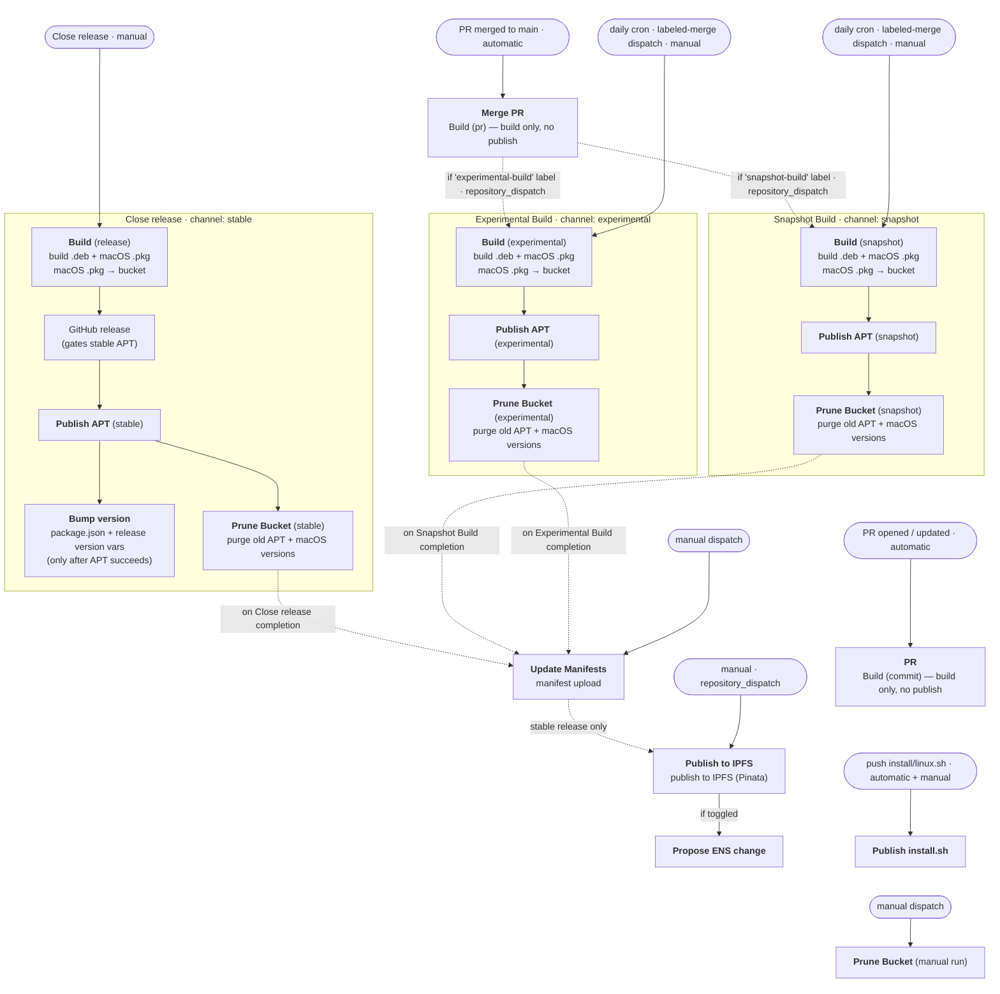

# Gnosis VPN

This repository collects the binary artifacts that compose the Gnosis VPN project.

## Installation

### Debian / Ubuntu

Install via the APT repository (recommended):

```bash
curl -fsSL https://download.gnosisvpn.io/linux/install.sh | bash
```

The script prompts for `sudo` itself when it needs to add the APT repository, install the package, or manage the systemd
service — once, up front, then caches it for the rest of the run. For non-interactive/headless use (no controlling
terminal for a sudo password prompt, e.g. CI or provisioning) or when already running as root, pipe into `sudo bash`
instead:

```bash
curl -fsSL https://download.gnosisvpn.io/linux/install.sh | sudo bash
```

The installer accepts options after `-s --`:

- `--channel=<stable|snapshot|experimental>` — APT channel to subscribe to; `snapshot` is the nightly channel of the
  standard installer line and `experimental` the nightly channel of the experimental line (default: `stable`). Env var:
  `GNOSISVPN_CHANNEL`.

  ```bash
  curl -fsSL https://download.gnosisvpn.io/linux/install.sh | bash -s -- --channel=snapshot
  curl -fsSL https://download.gnosisvpn.io/linux/install.sh | bash -s -- --channel=experimental
  ```

- `--network=<name>` — network to configure. Each channel only ships the networks of its own line, so which names are
  accepted depends on `--channel`. Env var: `GNOSISVPN_NETWORK`.

  | Channel              | Networks                | Default        |
  | -------------------- | ----------------------- | -------------- |
  | `stable`, `snapshot` | `jura-prod`, `jura-dev` | `jura-prod`    |
  | `experimental`       | `piz-palu-dev`          | `piz-palu-dev` |

  On `stable` and `snapshot`, omitting `--network` keeps an existing choice.

  ```bash
  curl -fsSL https://download.gnosisvpn.io/linux/install.sh | bash -s -- --network=jura-dev
  ```

- `--reset-identity` — back up the worker's config directory (`/var/lib/gnosisvpn/.config/`, holding the HOPR identity,
  safe, and node database) by renaming it to `.config.<timestamp>.bak`, so the service generates a fresh identity on
  restart. The network selection and Blokli endpoint (`/etc/gnosisvpn/gnosisvpn-dynamic.env`) are kept. Env var:
  `GNOSISVPN_RESET_IDENTITY=true`.

  ```bash
  curl -fsSL https://download.gnosisvpn.io/linux/install.sh | bash -s -- --reset-identity
  ```

- `-h`, `--help` — show the installer's help and exit.

  ```bash
  curl -fsSL https://download.gnosisvpn.io/linux/install.sh | bash -s -- --help
  ```

Snapshot and experimental installs and upgrades pull from `download.gnosisvpn.io` only — the IPFS mirror serves just the
stable suite.

**Two installer lines.** The three channels come from two lines that differ in which client and app generation they are
built against, and therefore in which networks they ship:

| Line         | Channels             | Networks                | Client + app version |
| ------------ | -------------------- | ----------------------- | -------------------- |
| standard     | `stable`, `snapshot` | `jura-prod`, `jura-dev` | below `0.100.0`      |
| experimental | `experimental`       | `piz-palu-dev`          | `0.100.0` and above  |

**Switching channels:** re-run the installer with the desired `--channel`. When the target channel's newest package is
older than the installed one, the installer performs a pinned downgrade (plain `apt upgrade` would never move back on
its own). Because a channel switch also switches lines, the configured network may change: if the current network is not
shipped by the target channel, the channel's default is selected and `/etc/gnosisvpn/config.toml` is re-pointed at it. A
round trip through the other line therefore does not preserve a non-default network choice — pass `--network` to set it
again. Caution: a re-run without `--channel` selects the default (stable) — on a snapshot or experimental installation,
pass that channel again when re-running, e.g. to switch networks. Manually installing a `.deb` from another channel
(`sudo apt install ./gnosisvpn_*.deb`) re-points `/etc/apt/sources.list.d/gnosisvpn.sources` at that package's channel;
run `sudo apt-get update` afterwards.

The installer sets up the channel's default network on first install and, on the standard line, keeps an existing choice
on re-runs. To pick a different network — or to switch an existing installation — pass `--network` (combinable with
`--channel`; see [.deb Installation Environment Variables](#deb-installation-environment-variables)):

```bash
curl -fsSL https://download.gnosisvpn.io/linux/install.sh | bash -s -- --network=jura-dev
```

Manual repo setup (equivalent to what the installer does for the stable channel — it lists both mirrors, the IPFS/ENS
gateway and the CDN, as independent sources of the same signed packages; for the other channels set both `Suites:` and
`Components:` to the channel name — `snapshot` or `experimental` — and list only the `download.gnosisvpn.io` URI). The
`$(dpkg --print-architecture)` command detects the host architecture automatically:

```bash
# 1. Add the signing key
sudo install -dm 0755 /etc/apt/keyrings
curl -fsSL https://download.gnosisvpn.io/linux/apt/gnosisvpn-archive-keyring.gpg \
  | sudo install -m 0644 /dev/stdin /etc/apt/keyrings/gnosisvpn-archive-keyring.gpg

# 2. Add the repository
sudo tee /etc/apt/sources.list.d/gnosisvpn.sources >/dev/null <<EOF
Types: deb
URIs: https://download.vpn.gnosis.eth.limo/linux/apt https://download.gnosisvpn.io/linux/apt
Suites: stable
Components: main
Architectures: $(dpkg --print-architecture)
Signed-By: /etc/apt/keyrings/gnosisvpn-archive-keyring.gpg
EOF

# 3. Install
sudo apt-get update && sudo apt-get install -y gnosisvpn
```

Manual `.deb` download is available directly from [the releases page](https://github.com/gnosis/gnosis_vpn/releases), or
the APT pool at `https://download.gnosisvpn.io/linux/apt/pool/main/g/gnosisvpn/gnosisvpn_<version>_<arch>.deb` (with
matching `.asc` and `.sha256` sidecars at the same prefix). See [SECURITY.md](./SECURITY.md) for verification.

Install:

Either double-click the `.deb` file to open it in the App Center and then click the Install button, or run:

```bash
sudo apt install ./gnosisvpn_*.deb
```

To pick a network (and optionally a custom Blokli endpoint) when installing the `.deb` directly, set the environment
variables with `sudo env` (a plain `sudo GNOSISVPN_NETWORK=... apt install` only passes the variable through if your
sudoers policy keeps it, which is often disabled; `sudo env` always works):

```bash
sudo env GNOSISVPN_NETWORK=jura-dev apt install ./gnosisvpn_*.deb
sudo env GNOSISVPN_NETWORK=jura-dev GNOSISVPN_HOPR_BLOKLI_URL=https://blokli-jura.dev.hoprnet.link apt install ./gnosisvpn_*.deb
```

Note: re-installing the **same version** via `apt` does nothing — the package scripts don't re-run, so environment
variables passed this way are silently ignored. To change settings on an existing installation, re-run the installer
script with the matching flag (or use `sudo env GNOSISVPN_...=<value> dpkg -i ./gnosisvpn_*.deb`).

Installing the `.deb` directly also registers the APT source for the package's own channel, so subsequent
`apt-get update && apt-get upgrade` picks up new releases without running the installer script. The channel is inferred
from the package version: a version ending in `.experimental` is experimental, any other version containing `+` is
snapshot, and a plain `x.y.z` is stable. An existing `/etc/apt/sources.list.d/gnosisvpn.sources` is left untouched
unless it tracks a different channel.

Uninstall:

```bash
sudo apt remove gnosisvpn
```

### .deb Installation Environment Variables

Direct `.deb` installs have no flags — these environment variables configure the package scripts instead (set them with
`sudo env`, see above). They are also honored by the installer script.

- `GNOSISVPN_NETWORK=<name>` — network configuration to use; determines which configuration file is symlinked to
  `/etc/gnosisvpn/config.toml` during installation. Only the networks the package actually ships are accepted — they are
  listed in `/usr/share/gnosisvpn/networks` (first entry is the default): `jura-prod jura-dev` on the standard line,
  `piz-palu-dev` on the experimental line. Passing a network from the other line fails the install with the supported
  list, and if `config.toml` points at a network this package does not ship, the postinstall re-points it at the default
  and moves the Blokli endpoint with it (unless a custom `GNOSISVPN_HOPR_BLOKLI_URL` is set).

  ```bash
  sudo env GNOSISVPN_NETWORK=jura-dev apt install ./gnosisvpn_*.deb
  ```

- `GNOSISVPN_HOPR_BLOKLI_URL=<url>` — URL of the HOPR Blokli service. The effective URL is written to
  `/etc/gnosisvpn/gnosisvpn-dynamic.env` (which overrides the packaged `/etc/gnosisvpn/gnosisvpn.env` conffile, kept
  empty so upgrades stay prompt-free).

  ```bash
  sudo env GNOSISVPN_HOPR_BLOKLI_URL=https://blokli.example.com apt install ./gnosisvpn_*.deb
  ```

- `GNOSISVPN_RESET_IDENTITY=true` — back up the worker's config directory (`/var/lib/gnosisvpn/.config/`, holding the
  HOPR identity, safe, and node database) by renaming it to `.config.<timestamp>.bak` before the service starts, so a
  fresh identity is generated. The network selection and Blokli endpoint (`/etc/gnosisvpn/gnosisvpn-dynamic.env`) are
  kept (default: `false`).

  ```bash
  sudo env GNOSISVPN_RESET_IDENTITY=true apt install ./gnosisvpn_*.deb
  ```

### Network Tuning: TCP BBR

The package installs `/etc/sysctl.d/99-gnosisvpn-bbr.conf`, which switches the kernel to the BBR congestion control
algorithm together with the `fq` queueing discipline:

```
net.core.default_qdisc = fq
net.ipv4.tcp_congestion_control = bbr
```

Both are system-wide settings, not VPN-specific ones — they improve throughput and latency of traffic sent through the
tunnel. The postinstall also applies them right away, so no reboot is needed:

```bash
# enable BBR
sudo sysctl -w net.ipv4.tcp_congestion_control=bbr
sudo sysctl -w net.core.default_qdisc=fq
```

It skips that step when the kernel does not offer BBR, and it leaves an existing setting in charge when
`/etc/sysctl.conf` — or an `/etc/sysctl.d` drop-in sorting after ours — already pins a different
`net.ipv4.tcp_congestion_control`. In both cases the file stays installed, so `net.core.default_qdisc = fq` still
applies on the next boot; remove the file to keep the system as it is. Which of these happened is printed at the end of
the installation.

To disable it again:

```bash
sudo rm /etc/sysctl.d/99-gnosisvpn-bbr.conf
sudo sysctl -w net.ipv4.tcp_congestion_control=cubic
sudo sysctl -w net.core.default_qdisc=fq_codel
```

The file is a dpkg conffile: once removed, upgrades do not bring it back. `sudo apt purge gnosisvpn` removes it as well,
and the values stay as they are until they are reset with the `sysctl -w` commands above or the machine reboots.

## Reporting Issues

To help us manage feedback and improve the project, we use a discussion-first process for all bug reports and feature
requests.

### How to report an issue

1. Search existing [Discussions](../../discussions) and [Issues](../../issues) to check if your topic is already
   covered.
1. If not, start a new Discussion in the [Issues & Bug Reports](../../discussions/new?category=issues-bug-reports)
   category.
1. Provide as much detail as possible using the provided template.

The team will review all discussions and promote confirmed bugs or planned features to actionable issues.

## Building

### Requirements

- [Nix](https://nixos.org) (recommended) - Provides all build dependencies
- macOS 11.0 or later for mac packages
- Xcode Command Line Tools installed: `$ xcode-select --install` for mac packages

### Quick Start

**Debian (x86_64)**

```bash
just download deb x86_64-linux
just changelog
just manual
just package deb x86_64-linux true
# Or execute all commands together with
just all deb x86_64-linux true
```

**Debian (ARM64)**

```bash
just download deb aarch64-linux
just changelog
just manual
just package deb aarch64-linux true
# Or execute all commands together with
just all deb aarch64-linux true
```

**Mac**

```bash
just download dmg aarch64-darwin
just package dmg aarch64-darwin true
# Or execute all commands together with
just all dmg aarch64-darwin true
```

### APT repository

The **stable** APT repo is served over IPFS via the ENS gateway at `https://download.vpn.gnosis.eth.limo/linux/apt` (see
[IPFS deployment layout](#ipfs-deployment-layout)).

The full repository — stable plus the nightly `snapshot` and `experimental` suites — is served from
`https://download.gnosisvpn.io/linux/apt`, built and signed by [`scripts/publish-apt.sh`](scripts/publish-apt.sh), which
uses [`reprepro`](https://salsa.debian.org/brlink/reprepro) configured by
[`linux/apt/conf/distributions`](linux/apt/conf/distributions) to assemble `Packages` indexes and sign
`InRelease`/`Release.gpg` with the GnosisVPN GPG key. The new `InRelease` is uploaded last so the swap is atomic and apt
clients never see a half-updated repo. Stable publishing is gated on the GitHub release job in `release.yaml`, so apt
clients can never see a stable version that lacks a matching GitHub release. Nightly builds publish to the `snapshot`
and `experimental` suites from `build-binary.yaml` right after the Linux build completes. Each channel has its own
component and pool (`main`/`pool/main`, `snapshot`/`pool/snapshot`, `experimental`/`pool/experimental`), declared in
`linux/apt/conf/distributions`.

### IPFS deployment layout

```
<CID>/
├── index.html …                                       # website 'downloads' app (static export, at root)
├── keys/
│   └── gnosisvpn-public-key.asc                        # GnosisVPN GPG public key
├── linux/
│   └── apt/
│       ├── gnosisvpn-archive-keyring.gpg               # binary keyring (Signed-By:)
│       ├── dists/stable/                               # stable suite only (no snapshot on IPFS)
│       │   ├── InRelease
│       │   ├── Release
│       │   ├── Release.gpg
│       │   └── main/binary-{amd64,arm64}/Packages(+.gz)
│       └── pool/main/g/gnosisvpn/  gnosisvpn_<version>_{amd64,arm64}.deb(+.asc, +.sha256)
├── macos/
│   └── stable/   gnosisvpn_<version>_arm64.pkg(+.sha256)
└── manifests/                                              # consumed by the client app for auto-update
    ├── {linux-amd64,linux-arm64,macos-arm64}.json(+.asc, +.sha256)
    └── {linux-amd64,linux-arm64,macos-arm64}.ipfs.json(+.asc, +.sha256)   # client uses these over IPFS
```

### GCS bucket layout

Everything end users see is served from `gs://download.gnosisvpn.io` (CDN: `https://download.gnosisvpn.io`):

```
download.gnosisvpn.io/
├── linux/
│   ├── install.sh                                      # end-user APT installer
│   └── apt/
│       ├── gnosisvpn-archive-keyring.gpg               # binary keyring (Signed-By:)
│       ├── dists/
│       │   ├── stable/
│       │   │   ├── InRelease                           # clearsigned, atomic pointer
│       │   │   ├── Release
│       │   │   ├── Release.gpg
│       │   │   └── main/binary-{amd64,arm64}/Packages(+.gz)
│       │   ├── snapshot/                               # same shape, component is `snapshot/` (not `main/`)
│       │   └── experimental/                           # same shape, component is `experimental/`
│       └── pool/
│           ├── main/g/gnosisvpn/          gnosisvpn_<version>_{amd64,arm64}.deb(+.asc, +.sha256)   # stable, every release
│           ├── snapshot/g/gnosisvpn/      gnosisvpn_<version>_{amd64,arm64}.deb(+.asc, +.sha256)   # nightly, append-only
│           └── experimental/g/gnosisvpn/  gnosisvpn_<version>_{amd64,arm64}.deb(+.asc, +.sha256)   # nightly, append-only
├── macos/                                                  # <version> uses '-' in place of '+' (Artifact Registry compat)
│   ├── stable/         gnosisvpn_<version>_arm64.pkg(+.sha256)
│   ├── latest/         gnosisvpn_<version>_arm64.pkg(+.sha256)   # snapshot
│   └── experimental/   gnosisvpn_<version>_arm64.pkg(+.sha256)
└── manifests/                                              # consumed by the client app for auto-update
    ├── {linux-amd64,linux-arm64,macos-arm64}.json(+.asc, +.sha256)        # channels: stable, snapshot, experimental
    └── {linux-amd64,linux-arm64,macos-arm64}.ipfs.json(+.asc, +.sha256)   # IPFS stable-only variant
```

The `experimental` key appears in the per-platform manifests only once the Experimental Build workflow has published
once; it is never added to the `.ipfs.json` variants, because experimental is not mirrored to IPFS.

### Scripts

- `common.sh` — shared utility functions (logging, version checks)
- `config.sh` — static configuration used by the build, packaging and manifest scripts: `MIN_OS_*`, `MIN_APP_VERSION`,
  the per-channel retention counts, `COMPONENT_VERSION_BOUNDARY` (the client/app version that separates the two
  installer lines) and `NETWORKS_STANDARD` / `NETWORKS_EXPERIMENTAL` (the networks each line ships)
- `download-binaries.sh` — downloads pre-built upstream binaries (`gnosis_vpn-client`, `gnosis_vpn-app`) from GCP
  Artifact Registry
- `generate-changelog.ts` — aggregates merged PRs across the three repos; emits zulip/github/debian/json/rpm formats
  (requires Deno)
- `generate-manual.sh` — creates man pages (Linux only)
- `generate-package.sh` — dispatcher that invokes the Linux or macOS packaging script
- `generate-package-linux.sh` — builds the `.deb` via nfpm, GPG-signs it, writes `.asc` and `.sha256` sidecars
- `generate-package-mac.sh` — builds the macOS `.pkg` via `productbuild` and notarizes with Apple
- `generate-update-manifest.sh` — builds per-platform JSON manifests (`linux-amd64.json`, etc.) consumed by the client
  app for auto-update
- `publish-apt.sh` — builds and signs the APT repo (`Packages`, `InRelease`, `Release.gpg`) and publishes it to GCS

## Dependency Updates

Renovate runs on Renovate's `schedule:earlyMondays` preset with a 14-day minimum release age, so most PRs appear early
Monday morning and only for packages that have been released for at least two weeks.

Updates are grouped by ecosystem:

| Group               | What it covers                                        | Notes                                                                                                 |
| ------------------- | ----------------------------------------------------- | ----------------------------------------------------------------------------------------------------- |
| `nix flake updates` | `flake.lock` inputs (nixpkgs, crane, rust-overlay, …) | digest/pinDigest updates; `pinDigests` disabled for the `nix` manager since nix pins via `flake.lock` |
| `github-actions`    | `.github/workflows` action refs                       | digest-pinned                                                                                         |
| _(individual PRs)_  | Cargo crates                                          | one PR per crate                                                                                      |

`prCreation: immediate` is intentional — CI only triggers on pull request events, so waiting for branch checks would
deadlock.

## CI/CD workflows

The diagram below shows every GitHub Actions workflow, what triggers each one (automatic vs. manual), and how they chain
together across the **stable**, **snapshot** and **experimental** channels. `Build`, `Publish APT`, and `Prune Bucket`
are reusable workflows (`workflow_call`) invoked as ordered steps by the channel pipelines; `Prune Bucket` can also be
run manually. On the stable channel the version bump (`package.json` + release version variables) is deferred until
`Publish APT` succeeds — until then nothing permanent touches the branch, so a failed release rolls back by just
deleting the GitHub release and tag.

`Snapshot Build` and `Experimental Build` are the two nightly pipelines. They are separate top-level workflows because
`Update Manifests` triggers on the workflow name and because `schedule` events cannot carry inputs; their crons are
staggered (01:00 and 02:00 UTC) so they do not queue on `Build`'s concurrency group. Each tracks its own
`GNOSISVPN_*_PR_VERSION` repository variables for the "nothing changed, skip the build" check, and writes the version
and date that `Update Manifests` reads for its channel.


```mermaid
flowchart TD
    %% ---------------- Layout only: keep the three entry triggers on one row at the top ----------------
    %% A transparent subgraph laid out left-to-right pins its members to a single rank,
    %% regardless of how deep each trigger's downstream chain runs.
    subgraph TRIG[" "]
      direction LR
      trRel([Close release · manual])
      trMerge([PR merged to main · automatic])
      trSnap([daily cron · labeled-merge dispatch · manual])
      trExp([daily cron · labeled-merge dispatch · manual])
    end
    style TRIG fill:transparent,stroke:transparent

    %% ---------------- Dev builds (no publish) ----------------
    trMerge --> MERGE["<b>Merge PR</b><br/>Build (pr) — build only, no publish"]
    MERGE -. "if 'snapshot-build' label · repository_dispatch" .-> NBUILD
    MERGE -. "if 'experimental-build' label · repository_dispatch" .-> XBUILD

    %% ---------------- Stable channel ----------------
    trRel --> SBUILD
    subgraph S["Close release · channel: stable"]
      direction TB
      SBUILD["<b>Build</b> (release)<br/>build .deb + macOS .pkg<br/>macOS .pkg → bucket"] --> SGH["GitHub release<br/>(gates stable APT)"]
      SGH --> SAPT["<b>Publish APT</b> (stable)"]
      SAPT --> SBUMP["<b>Bump version</b><br/>package.json + release version vars<br/>(only after APT succeeds)"]
      SAPT --> SPRUNE["<b>Prune Bucket</b> (stable)<br/>purge old APT + macOS versions"]
    end

    %% ---------------- Snapshot channel ----------------
    trSnap --> NBUILD
    subgraph N["Snapshot Build · channel: snapshot"]
      direction TB
      NBUILD["<b>Build</b> (snapshot)<br/>build .deb + macOS .pkg<br/>macOS .pkg → bucket"] --> NAPT["<b>Publish APT</b> (snapshot)"]
      NAPT --> NPRUNE["<b>Prune Bucket</b> (snapshot)<br/>purge old APT + macOS versions"]
    end

    %% ---------------- Experimental channel ----------------
    trExp --> XBUILD
    subgraph X["Experimental Build · channel: experimental"]
      direction TB
      XBUILD["<b>Build</b> (experimental)<br/>build .deb + macOS .pkg<br/>macOS .pkg → bucket"] --> XAPT["<b>Publish APT</b> (experimental)"]
      XAPT --> XPRUNE["<b>Prune Bucket</b> (experimental)<br/>purge old APT + macOS versions"]
    end

    %% ---------------- Manifests → IPFS → ENS ----------------
    SPRUNE -. "on Close release completion" .-> MAN
    NPRUNE -. "on Snapshot Build completion" .-> MAN
    XPRUNE -. "on Experimental Build completion" .-> MAN
    trMan([manual dispatch]) --> MAN["<b>Update Manifests</b><br/>manifest upload"]
    MAN -. "stable release only" .-> IPFS["<b>Publish to IPFS</b><br/>publish to IPFS (Pinata)"]
    trIpfs([manual · repository_dispatch]) --> IPFS
    IPFS -->|if toggled| ENS["<b>Propose ENS change</b>"]

    %% ---------------- Far-right column: PR build + standalone publishers ----------------
    trPR([PR opened / updated · automatic]) --> PR["<b>PR</b><br/>Build (commit) — build only, no publish"]
    trPush([push install/linux.sh · automatic + manual]) --> INSTALL["<b>Publish install.sh</b>"]
    trPruneM([manual dispatch]) --> PRUNEM["<b>Prune Bucket</b> (manual run)"]

    %% ---------------- Layout only: invisible links (~~~), no semantic meaning ----------------
    %% manifests group sits below the nightly groups
    XPRUNE ~~~ trMan
    %% attach the standalone column to the snapshot group's right so it packs far right,
    %% declared after trMan so it biases to the right of the manifests column
    NPRUNE ~~~ trPR
    %% stack the far-right column (PR build → install.sh → manual prune) top-to-bottom
    PR ~~~ trPush
    INSTALL ~~~ trPruneM
```
